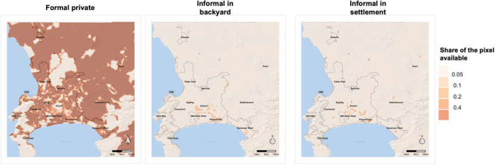

.. image:: images/banner_crop.png
   :width: 100 %
   :alt: Sponsors' logo banner

|

=======================
Technical documentation
=======================

-----------------
Code walk-through
-----------------

The project repository is composed of a ``main_nb`` script, a ``calib_nb`` script (a static version of which is shown in :doc:`main_nb` and :doc:`calib_nb`), and ``plots`` scripts, themselves calling on several secondary scripts and custom packages. Those packages in turn include modules that are used at different steps of the code:

* ``inputs``: contains the modules used to import default parameters and options, as well as pre-treated data.
* ``equilibrium``: contains the modules used to compute the static equilibrium allocation, as well as the dynamic simulations.
* ``outputs``: contains the modules used to visualize results and data.
* ``calibration``: contains the modules used to re-run the calibration of parameters if necessary.

All the scripts placed at the root start with a preamble that imports (python and custom) packages to be used, and defines the file paths that integrate the repository to the local system of the user. They then go on calling the packages described above. They make almost all the same calls on the ``inputs`` package, then specific calls depending on the script (``main_nb`` mostly draws on ``equilibrium``, ``calib_nb`` on ``calibration``, and ``plots`` scripts on ``outputs``). Let us start describing those packages by following along the ``main_nb`` script (we refer the reader to :doc:`api_ref` for detailed information on the functions we will use).

|

------
Inputs
------

^^^^^^^^^^^^^^^^^^^^^^
Parameters and options
^^^^^^^^^^^^^^^^^^^^^^

In this part, the code calls on the ``parameters_and_options.py`` module that imports the default parameters and options, then sets the timeline for the simulations, and overwrites the default parameters and options according to the specific scenario one is interested in. The detail of key parameters and options is given in :doc:`../input_tables` (there are other technical parameters and options that should be of no interest for the end user) [#f1]_. Typically, one may set options allowing or not agents to anticipate floods, take climate climate change into account, or new informal settlements to be built.

Note that, on top of the ``import_options`` and ``import_param`` functions, the code later calls on a ``import_construction_parameters`` function that makes use of imported data to define additional parameter variables.

The key ones are the ``mini_lot_size`` parameter and the ``agricultural_rent`` variable (defined through ``compute_agricultural_rent`` as a function of other parameters). Here is how to interpret the value of agricultural rent. We assume that the price of agricultural land (corresponding to landlords' outside options / opportunity cost, here ``agricultural_price_baseline`` parameter) is fixed and that agricultural land is undeveloped. Since we assume that developers make zero profit in equilibrium due to pure and perfect competition, this gives us a relation to obtain the minimum rent developers would be willing to accept if this land were urbanized [#fagri]_:

.. math::

   R_A = \frac{(\delta P_A)^a (\rho + \delta)^{1-a}}{\kappa a^a (1-a)^{1-a}}

In the ``compute_agricultural_rent`` function, this corresponds to:

.. literalinclude:: ../inputs/parameters_and_options.py
   :language: python
   :lines: 663-669
   :lineno-start: 663

Below this rent, it is therefore never profitable to build housing. Agricultural rent defines a floor on equilibrium rent values as well as an endogenous city edge.

To store the output in a dedicated folder, we create a name associated to the parameters and options used. This name is a code associated to the options, parameters, and scenarios that we changed across our main simulation runs. They can be safely updated by the end user.

^^^^^^^^^^^
Assumptions
^^^^^^^^^^^

Note that, in the model, we consider three endogenous housing markets (whose allocation is computed in equilibrium) - namely, formal private housing, informal backyards (erected in the backyard of formal subsidized housing dwelling units), and informal settlements (in predetermined locations) [#f2]_ - one exogenous housing market (whose allocation is directly taken from the data) - the RDP (Reconstruction and Development Programme) formal subsidized housing [#f3]_ - and four income groups.

By default, only agents from the poorest income group have access to RDP housing units. Without loss of generality, we assume that the price of such dwellings is zero, and that they are allocated randomly to the fraction of poorest agents they can host, the rest being rationed out of the formal subsidized housing market. Then, the two poorest income groups sort across formal private housing, informal backyards, and informal settlements; whereas the two richest only choose to live in the formal private housing units. Those assumptions are passed into the code through the ``income_class_by_housing_type`` parameter. We believe that this is a good approximation of reality. Also note that, although the two richest income groups are identical in terms of housing options, we distinguish between them to better account for income heterogeneity and spatial sorting along income lines in our simulations, while keeping the model sufficiently simple to be solved numerically.

   Modeling assumptions regarding housing (*Source*: :cite:t:`pfeiffer`)

^^^^
Data
^^^^

Then, the code calls on the ``data.py`` module. This allows to import basic geographic data, macro data, households and income data, land use projections, flood data, scenarios for time-dependent variables, and transport data (see :doc:`../readme_link` for the appropriate tree structure where to locate the data folder). The databases used are presented in :doc:`../data_bases`. A more detailed view on the specific data sets called in the code, and their position in the folder architecture, is given in :doc:`../data_sets` [#fdata]_.

It should be noted that, by default, housing type data (used for validation) has already been converted from the SAL (Small Area Level) dimension to the grid dimension (500x500m pixels) with the ``import_sal_data`` and ``gen_small_areas_to_grid`` functions, and that income net of commuting costs for each income group and each grid cell (from transport data) has already been computed from the calibrated incomes for each income group and each job center with the ``import_transport_data`` function. If one wants to run the process again, one needs to overwrite the associated default options (please note that this may take some time to run). The import of flood data (through the ``import_full_floods_data`` function) is also a little time-consuming when agents are set to anticipate floods.

A bit counter-intuitively, the scenario for the interest rate does not only serve to define future values of the variable (more on that in :ref:`subsequent_periods`), but also its value at the initial state (as the raw data contains both past and future values). As part of the ``import_macro_data`` function, the ``interest_rate`` variable is defined as an average over the past three years, through the ``interpolate_interest_rate`` function defined in the ``functions_dynamic.py`` module (included in the ``equilibrium`` package). This allows to smooth outcomes around a supposed equilibrium value:

.. literalinclude:: ../inputs/data.py
   :language: python
   :lines: 338-351
   :lineno-start: 338

.. literalinclude:: ../equilibrium/functions_dynamic.py
   :language: python
   :lines: 292-314
   :lineno-start: 292

The imported files can be modified directly in the data repository, to account for changes in scenarios for instance, as long as the format used remains the same (see :doc:`../api_ref` for more details on each function requirements). Before going to the next step of the code, we would like to give more details on the imports of land use, flood, and transport data, which we think are not as transparent as the rest of the imports.

.. _land_avail_desc:

"""""""""""""
Land use data
"""""""""""""

The ``import_land_use`` and ``import_coeff_land`` functions define exogenous land availability :math:`L^h(x)` for each housing type :math:`h` and each grid cell :math:`x`. Indeed, we assume that different kinds of housing do not get built in the same places to account for insecure property rights (in the case of informal settlements vs. formal private housing) and housing specificities (in the case of non-market formal subsidized housing and informal backyards located in the same premises) [#fmixed]_. Furthermore, :math:`L` varies with :math:`x` to account for both natural and regulatory constraints, infrastructure and other non-residential uses.

As :math:`L^h(x)` is going to vary across time periods, the first part of the ``import_land_use`` function imports estimates for historical and projected land uses. It then defines linear regression splines over time for a set of variables, the key ones being the share of pixel area available for formal subsidized housing, informal backyards, informal settlements, and unconstrained development. Note that, in our benchmark (allowing for informal settlement expansion), land availability for informal settlements is defined over time by the intersection between the timing map below and the high and very high probability areas (also defined below).

   Estimated timing of future new informal settlements (*Source*: expert estimates)

   Estimated probability of future new informal settlements (*Source*: expert estimates)

The ``import_coeff_land`` function then takes those outputs as arguments and reweight them by a housing-specific maximum land-use parameter. This parameter allows to reduce the development potential of each area to its housing component (accounting for roads, for instance). The share of pixel area available for formal private housing (in a given period) is simply defined as the share of pixel area available for unconstrained development, minus the shares dedicated to the other housing types, times its own maximum land use parameter:

.. literalinclude:: ../inputs/data.py
   :language: python
   :lines: 944-954
   :lineno-start: 944

The outputs are stored in a ``coeff_land`` matrix that yields the values of :math:`L^h(x)` for each time period when multiplied by the area of a pixel. Results are shown in the figure below.

   Share of available land for each housing type (*Source*: :cite:t:`pfeiffer`)

""""""""""
Flood data
""""""""""

Flood data is processed through the ``import_init_floods_data``, ``compute_fraction_capital_destroyed``, and ``import_full_floods_data`` functions.

The ``import_init_floods_data`` function imports the pre-processed flood maps from FATHOM :cite:p:`sampson` for fluvial and pluvial risks, and DELTARES :cite:p:`deltares` for coastal risks. Those maps yield for each grid cell an estimate of the pixel share that is exposed to a flood of some maximum depth level, reached in a given year with a probability equal to the inverse of their return period. For instance, a flood map corresponding to a return period of 100 years considers events that have a 1/100 chance of occurring in any given year.

.. figure:: ../../Output/input_plots/P_100yr_map_depth.png
   :scale: 70% 
   :align: center
   :alt: map of land availability ratios per housing type

   Maximum pluvial flood depth (in meters) for a 100-year return period (*Source*: FATHOM)

Note that the return periods considered are not the same for FATHOM and DELTARES data, and that different flood maps are available depending on the digital elevation model (DEM) considered, whether we account for sea-level rise, and whether we account for defensive infrastructure with respect to fluvial floods [#f4]_. 

The function then imports depth-damage estimates from the existing literature. Those estimates, used in the insurance market, link levels of maximum flood depth to fractions of capital destroyed, depending on the materials affected by floods [#f5]_. More specifically, we use estimates from :cite:t:`englhardt` for damages to housing structures (depending on housing type), and from :cite:t:`villiers` for damages to housing contents.

On this basis, the ``compute_fraction_capital_destroyed`` function integrates flood damages over the full range of return periods, for each flood type and damage function [#f6]_. This yields an annualized fraction of capital destroyed, corresponding to its expected value in a given year [#f7]_.

Finally, the ``import_full_floods_data`` function uses those outputs to define the depreciation term :math:`\rho_{h}^{d}(x)` that is specific to housing type :math:`h`, damage type (structures or contents) :math:`d`, and location :math:`x` (stored in the ``fraction_capital_destroyed`` matrix), by taking the maximum across fractions of capital destroyed for all flood types considered (a conservative assumption). When multiplied by some capital value, this term yields the expected economic cost from flood risks that is considered by anticipating agents when solving for equilibrium. It is also equal to the risk premium in the case of a perfect risk-based insurance market (leading to full insurance with actuarially fair prices) [#f8]_.

.. figure:: ../../Output/input_plots/structure_informal_settlements_fract_K_destroyed.png
   :scale: 70% 
   :align: center
   :alt: map of annualized fraction of capital destroyed for structures in informal settlements

   Annualized fraction of capital destroyed for structures in informal settlements

""""""""""""""
Transport data
""""""""""""""

Transport data is processed through the ``import_transport_data`` function. It imports monetary and time transport costs, and pre-calibrated incomes (``income_centers_init`` parameter) per income group and job center (more on that in :ref:`transport_costs`), for a given dimension (grid-cell level or Small Place level) and a given simulation year (zero at initial state):

.. literalinclude:: ../inputs/data.py
   :language: python
   :lines: 1955-1961
   :lineno-start: 1955

.. literalinclude:: ../inputs/data.py
   :language: python
   :lines: 1982-2001
   :lineno-start: 1982

From there, it computes several outputs, of which the key variable is the expected income net of commuting costs :math:`\tilde{y}_i(x)`, earned by a household of income group :math:`i` choosing to live in :math:`x` (stored in the ``income_net_of_commuting_costs`` matrix). It is obtained by recursively solving for the optimal transport mode choice and job center choice of households characterized by :math:`i` and :math:`x` (see :doc:`../math_appendix` for more details). 

|

.. _equilibrium_desc:

-----------
Equilibrium
-----------

This part of the ``main_nb`` script simply calls on two functions that return the key outputs of the model: ``compute_equilibrium`` solves the static equilibrium for baseline year, and ``run_simulation`` solves its dynamic version for all pre-defined subsequent years. Those functions in turn call on modules in the ``sub`` directory.

^^^^^^^^^^^^^
Initial state
^^^^^^^^^^^^^

Let us first dig into the ``compute_equilibrium`` function. Our main input is the total population per income group in the city at baseline year (2011). Since we took the non-employed (earning no income over the year) out to define our four income groups (with the ``inputs.data.import_income_classes_data`` function), we need to reweight total population to account for the overall number of households [#active_pop]_:

.. literalinclude:: ../equilibrium/compute_equilibrium.py
   :language: python
   :lines: 145-146
   :lineno-start: 145

The associated distribution is given below:

   Income groups used in the simulation (*Source*: :cite:t:`pfeiffer`)

Then, considering that all formal subsidized housing belongs to the poorest income group, we substract the corresponding number of households from this class to keep only the ones whose allocation in the housing market is going to be determined endogenously:

.. literalinclude:: ../equilibrium/compute_equilibrium.py
   :language: python
   :lines: 167-168
   :lineno-start: 167

Finally, we shorten the grid to consider only habitable pixels (according to land availability and expected income net of commuting costs) to reduce numeric computations, and initialize a few key variables before starting the optimization per se:

.. literalinclude:: ../equilibrium/compute_equilibrium.py
   :language: python
   :lines: 171-177
   :lineno-start: 171

.. _solving_desc:

"""""""""""""""""""""""
Solving for equilibrium
"""""""""""""""""""""""

Note that, among those variables, we define arbitrary values for utility levels across income groups:

.. literalinclude:: ../equilibrium/compute_equilibrium.py
   :language: python
   :lines: 218-220
   :lineno-start: 218

This relates to the way this class of models is solved: as a closed-city equilibrium model, **NEDUM-2D** takes total population (across income groups) as exogenous, and utility levels (across income groups) as endogenous [#f9]_.

It is then solved iteratively in four steps:

* We first derive housing demand for each housing type
* We deduce rents for each housing type
* We then compute housing supply for each housing type
* From there, we obtain population in all locations for all housing types.

We update initial utility levels depending on the gap between the target and simulated population, and re-iterate the process until we reach a satisfying error level [#f10]_, according to the values of the parameters ``precision`` and ``max_iter``. Of course, the closer the initial guess is to the final values, the quicker the algorithm converges. We will see below how each of the intermediate steps is computed.

A last word on the choice of a closed vs. open-city model: within a static framework, it is generally considered that closed-city models are a better representation of short-term outcomes and open-city models of long-term outcomes, as population takes time to adjust through migration. Here, we rely on scenarios from the CoCT (informed by more macro parameters than open-city models usually are) to adjust total population across time periods. Sticking to the closed-city model in those circumstances allows us to make welfare assessments based on utility changes without renouncing to the possibility that migrations occur.

.. _functional_assumpt:

""""""""""""""""""""""
Functional assumptions
""""""""""""""""""""""

Then, the ``compute_equilibrium`` function calls on the ``compute_outputs`` function for each endogenous housing type, which in turn calls on functions defined as part of the ``functions_solver.py`` module. This module applies formulas derived from the optimization process described in :cite:t:`pfeiffer`. 

Let us just rephrase the main assumptions here (refer to the paper for a discussion on those [#fCD]_). The parameters highlighted in green are specific to a model with agents that perfectly anticipate flood risks.

On the one hand, households maximize Stone-Geary preferences:

.. math::

   U(z,q,x,h) = z^\alpha (q-q_0)^{1-\alpha}A(x)B^h(x)

* :math:`z` is the quantity of composite good consumed (in monetary terms) and :math:`q` is the quantity of housing consumed (in m²). They are the choice variables [#fchoice]_.
* :math:`x` is the location where the household lives and :math:`h` is the housing type considered. They are the state variables.
* :math:`\alpha` is the composite good elasticity (``alpha`` parameter), :math:`1 - \alpha` is the surplus housing elasticity, and :math:`q_0` (``q0`` parameter) is the basic need in housing.
* :math:`A(x)` is a (centered around one) location-specific amenity index (``precalculated_amenities`` parameter) and :math:`B^h(x)` is a (positive) location-specific disamenity index equal to one in formal sectors and smaller than one in informal sectors (``pockets`` and ``backyard_pockets`` parameters), to account for the negative externalities associated with living in such housing (such as eviction probability, etc.) [#fB]_. They are (calibrated) parameters.

They are facing the following budget constraint (optimization under constraint):

.. math::
   
   \tilde{y}_i(x) + \mathbb{1}_{h=FS} \mu(x)YR_{IB}(x) = (1 + \textcolor{green}{\gamma \rho_{h}^{contents}(x)})z + q_{h}R_{h}(x) + \mathbb{1}_{h \neq FP} (\rho + \textcolor{green}{\rho_{h}^{struct}(x)} + \mathbb{1}_{h \neq FS} \delta)v_{h}

* :math:`\tilde{y}_i(x)` is the expected income net of commuting costs for a household of income group :math:`i` living in location :math:`x`.
* :math:`\mathbb{1}_{h=FS}` is an indicator variable for living in the formal subsidized housing sector. Indeed, such households have the possibility to rent out an endogenous fraction :math:`\mu(x)` of their backyard of fixed size :math:`Y` (``backyard_size`` parameter) at the endogenous market rent :math:`R_{IB}(x)`.
* :math:`\textcolor{green}{\gamma}` is the fraction of composite good exposed to floods (``fraction_z_dwellings`` parameter) and :math:`\textcolor{green}{\rho_{h}^{contents}(x)}` is the fraction of contents capital destroyed (that is location and housing-type specific): households need to pay for damages to their belongings.
* :math:`q_{h}` is the (housing-type specific) amount of housing consumed, at the endogenous annual rent :math:`R_{h}(x)`.
* :math:`\mathbb{1}_{h \neq FP}` is an indicator variable for living in a sector different from the formal private one. Indeed, such households (assimilated to owner-occupiers, more on that below) need to pay for the maintenance of their housing of capital value :math:`v_{h}` (``subsidized_structure_value`` and ``informal_structure_value`` parameters) that depreciate at rate :math:`\rho + \textcolor{green}{\rho_{h}^{struct}(x)}` (``depreciation_rate`` parameter + ``fraction_capital_destroyed`` matrix).
* :math:`\mathbb{1}_{h \neq FS}` is an indicator variable for living in a sector different from the formal subidized one. Indeed, among the set of households described above, those who live in the informal sector (either backyards or settlements) also need to pay for the construction of their "shack" of capital value :math:`v_{h}` [#FSdev]_. To do so, they pay a fraction of capital value :math:`\delta` (``interest_rate`` variable) of this price each year, which corresponds to the interest paid on an infinite debt (which is a good-enough approximation in a static setting).

On the other hand, formal private developers have a Cobb-Douglas housing production function expressed as:

.. math::

   s_{FP}(k) = \kappa k^{1-a}

* :math:`s_{FP}` is the housing supply per unit of available land (in m² per km²).
* :math:`\kappa` is a (calibrated) scale factor (``coeff_A`` parameter).
* :math:`k = \frac{K}{L_{FP}}` is the (endogenous) amount of capital per unit of available land (in monetary terms).
* :math:`a` is the (calibrated) land elasticity of housing production (``coeff_a`` parameter).

They therefore maximize a profit function (per unit of available land) defined as:

.. math::

   \Pi(x,k) = R_{FP}(x)s_{FP}(k) - (\rho + \textcolor{green}{\rho_{FP}^{struct}(x)} + \delta)k - \delta P(x)

* :math:`R^{FP}(x)` is the (endogenous) market rent for formal private housing.
* :math:`P(x)` is the (endogenous) price of land.
* :math:`k` is the choice variable and :math:`x` is the state variable.

Underlying those functional forms are structural assumptions about the maximization objective of agents on the supply and demand sides of each housing submarket:

* In the formal private sector, developers buy land from absentee landlords and buy capital to build housing on this land [#fabsentee]_. They then rent out the housing at the equilibrium rent over an infinite horizon [#fconstant]_. They therefore internalize the costs associated with capital depreciation (both general and from structural flood damages) and interest rate (at which future flows of money are discounted). Households just have to pay for damages done to the content of their home [#fequiv]_.
* In the formal subsidized sector, (poor) households rent / buy housing for free from the State (owner-occupiers). They only pay for overall capital depreciation (general and from structural and content damages), and may rent out a fraction of their backyard.
* In the informal backyard sector, households rent a fraction of backyard (not directly housing) owned by formal subsidized housing residents and are responsible for building their own "shack" (owner-occupiers). Then, they pay for overall capital depreciation (general and from structural and content damages) and interest over construction costs too.
* In the informal settlement sector, households rent land from absentee landlords (not directly housing) and are responsible for building their own "shack" (owner-occupiers). Then, they pay for overall capital depreciation (general and from structural and content damages) and interest over construction costs too.

Note that both optimization programmes are concave, hence they can be maximized using first-order optimality conditions (setting the partial derivatives to zero), as detailed in :cite:t:`pfeiffer`.

"""""""""""""""""""""""""
Equilibrium dwelling size
"""""""""""""""""""""""""

As announced in the :ref:`solving_desc` subsection, the ``compute_outputs`` function starts by computing housing demand / dwelling size (in m²) for each housing type through the ``compute_dwelling_size_formal`` function. Optimization over the households' programme described above implicitly defines this quantity in the formal private sector:

.. math::

   u = (\frac{\alpha \tilde{y}_i(x)}{1 + \textcolor{green}{\gamma \rho_{FP}^{contents}(x)}})^\alpha \frac{Q^*-q_0}{(Q^* - \alpha q_0)^\alpha} A(x)

* :math:`u` is the fixed utility level
* :math:`Q*` is the equilibrium dwelling size

By reorganizing the above equation, we obtain the following left and right sides in the code:

.. literalinclude:: ../equilibrium/sub/functions_solver.py
   :language: python
   :lines: 58-64
   :lineno-start: 58

.. literalinclude:: ../equilibrium/sub/functions_solver.py
   :language: python
   :lines: 123-126
   :lineno-start: 123

The ``compute_dwelling_size_formal`` function then recovers the value of :math:`Q*` (depending on income group) through a linear interpolation, before constraining it to be larger than the parametrized minimum dwelling size in this sector (``mini_lot_size`` parameter):

.. literalinclude:: ../equilibrium/sub/functions_solver.py
   :language: python
   :lines: 81-89
   :lineno-start: 81

Back to the ``compute_outputs`` function, the dwelling size in informal backyards and informal settlements is exogenously set as being the standard parametrized size of a "shack" (``shack_size`` parameter).

""""""""""""""""
Equilibrium rent
""""""""""""""""

Plugging this back into the first-order optimality condition for formal private households, and just inverting the households' programme for informal backyards and settlements, we obtain the following bid rents in each sector, depending on income group:

.. math::

   \Psi_i^{FP}(x,u) = \frac{(1-\alpha)\tilde{y}_i(x)}{Q_{FP}(x,i,u) - \alpha q_0} 

* :math:`Q_{FP}(x,i,u) = max(q_{min},Q^*)`

.. math::

   \Psi_i^{IB}(x,u) = \frac{1}{q_I}[\tilde{y}_i(x) - (\rho + \delta + \textcolor{green}{\rho_{IB}^{struct}})v_I - (1 + \textcolor{green}{\gamma \rho_{IB}^{contents}})(\frac{u}{(q_I-q_0)^{1-\alpha}A(x)B_{IB}(x)})^\frac{1}{\alpha}]

.. math::

   \Psi_i^{IS}(x,u) = \frac{1}{q_I}[\tilde{y}_i(x) - (\rho + \delta + \textcolor{green}{\rho_{IS}^{struct}})v_I - (1 + \textcolor{green}{\gamma \rho_{IS}^{contents}})(\frac{u}{(q_I-q_0)^{1-\alpha}A(x)B_{IS}(x)})^\frac{1}{\alpha}]

In the ``compute_outputs`` function, this corresponds to:

.. literalinclude:: ../equilibrium/sub/compute_outputs.py
   :language: python
   :lines: 155-156
   :lineno-start: 155

.. literalinclude:: ../equilibrium/sub/compute_outputs.py
   :language: python
   :lines: 185-202
   :lineno-start: 185

.. literalinclude:: ../equilibrium/sub/compute_outputs.py
   :language: python
   :lines: 210-225
   :lineno-start: 210

Bid rents :math:`\Psi^i_h(x,u)` correspond to the maximum amount households of type :math:`i` are willing to pay for a unit (1 m²) of housing of type :math:`h` in a certain location :math:`x` for a given utility level :math:`u` (over one year). Assuming that households bid their true valuation and that there are no strategic interactions, housing / land [#fhland]_ is allocated to the highest bidder. This is why we retain the bid rents from the highest bidding income groups, and the associated dwelling sizes, as the equilibrium output values for rents and dwelling sizes. In the code, this corresponds to:

.. literalinclude:: ../equilibrium/sub/compute_outputs.py
   :language: python
   :lines: 233-254
   :lineno-start: 233

.. _equil_hsupply:

""""""""""""""""""""""""""
Equilibrium housing supply
""""""""""""""""""""""""""

Then, the ``compute_outputs`` function goes on calling the ``compute_housing_supply_formal`` and ``compute_housing_supply_backyard`` functions.

In the formal private sector, profit maximization of developers with respect to capital yields:

.. math::

   s_{FP}(x) = \kappa^{\frac{1}{a}} (\frac{(1-a)R_{FP}(x)}{\rho + \textcolor{green}{\rho_{FP}^{struct}(x)} + \delta})^{\frac{1-a}{a}}

In the code, this corresponds to:

.. literalinclude:: ../equilibrium/sub/functions_solver.py
   :language: python
   :lines: 200-209
   :lineno-start: 200

In the informal backyard sector, utility maximization of households living in formal subsidized housing with respect to fraction of backyard rented out yields:

.. math::

   \mu(x) = \alpha \frac{q_{FS}-q_0}{Y} - (1-\alpha) \frac{\tilde{y}_1(x) - (\rho + \textcolor{green}{\rho_{FS}^{struct}(x)}) \textcolor{green}{h_{FS}}}{YR_{IB}(x)}

In the code, this corresponds to:

.. literalinclude:: ../equilibrium/sub/functions_solver.py
   :language: python
   :lines: 288-296
   :lineno-start: 288

Back to the ``compute_outputs`` function, the housing supply per unit of available land for informal settlements is just set as 1 km²/km². Indeed, as absentee landlords do not have outside use for their land, they face no opportunity cost when renting it out, and therefore rent out all of it. We also remind the reader that the informal backyard and settlement dwellings are not capital-intensive, to the extent that they have a fixed size and cover only one floor. The housing supply is therefore equal to the land supply. Again, this is a simplification, but we believe that this is a good enough approximation of reality.

""""""""""""""""""""""""""""""""
Equilibrium number of households
""""""""""""""""""""""""""""""""

At the end of the ``compute_outputs`` function, we just divide the housing supply per unit of available land by the dwelling size, and multiply it by the amount of available land to obtain the number of households by housing type in each grid cell. Then, we associate people in each selected pixel to the highest bidding income group (here denoted :math:`i`):

.. math::

   N_i^h(x) = \frac{s_h(x)L_h(x)}{Q_h(x,i,u)}

From there, we are able to recover the total number of households in each income group for a given housing type:

.. literalinclude:: ../equilibrium/sub/compute_outputs.py
   :language: python
   :lines: 280-293
   :lineno-start: 280

Also note that we ensure that the housing rent in the formal private sector is larger than the agricultural rent:

.. literalinclude:: ../equilibrium/sub/compute_outputs.py
   :language: python
   :lines: 297-298
   :lineno-start: 297

"""""""""""""""""""""
Iteration and results
"""""""""""""""""""""

Back to the body of the ``compute_equilibrium`` function, we sum the outputs of the ``compute_outputs`` function across grid cells to get the total number of households in each income group. Then, we define an error metric ``error_max_abs`` comparing this result with values from the data, and an incremental term ``diff_utility`` (depending on a predetermined convergence factor):

.. literalinclude:: ../equilibrium/compute_equilibrium.py
   :language: python
   :lines: 273-306
   :lineno-start: 273

As long as the error metric is above a predetermined precision level (``precision``), and the number of iterations is below a predetermined threshold (``max_iter``), we repeat the process described above after updating the utility levels with the incremental term:

.. literalinclude:: ../equilibrium/compute_equilibrium.py
   :language: python
   :lines: 326-330
   :lineno-start: 326

Note that we also update the convergence factor to help the algorithm converge.

.. literalinclude:: ../equilibrium/compute_equilibrium.py
   :language: python
   :lines: 338-355
   :lineno-start: 338

To complete the process, we concatenate (exogenous) values for formal subsidized housing to our final output vectors while taking care that all values have the same units:

.. literalinclude:: ../equilibrium/compute_equilibrium.py
   :language: python
   :lines: 450-460
   :lineno-start: 450

.. literalinclude:: ../equilibrium/compute_equilibrium.py
   :language: python
   :lines: 494-509
   :lineno-start: 494

We also return other outputs from the model, such as utility levels, the final error, or capital per unit of available land.

.. _subsequent_periods:

^^^^^^^^^^^^^^^^^^
Subsequent periods
^^^^^^^^^^^^^^^^^^

Back to the body of the ``main_nb`` script, we save the outputs for the initial state equilibrium in a dedicated subfolder (according to the naming convention defined in the preamble). Then, we launch the ``run_simulation`` function that takes them as an argument, and calls on the same modules as before, plus the ``functions_dynamic.py`` module.

After initializing a few key variables, the function starts a loop over predefined simulation years. The first part of the loop consists in updating the value of all time-moving variables. This is based on exogenous scenarios previously imported as inputs (through the ``import_scenarios`` function) and taken as an argument of the function. Provided by the CoCT, they provide trajectories for the following set of variables:

* Income distribution
* Inflation rate
* Interest rate
* Total population
* Price of fuel
* Land use

This leads to the update of, among others, number of households per income class, expected income net of commuting costs, capital values of formal subsidized and informal dwelling units: 

.. literalinclude:: ../equilibrium/run_simulations.py
   :language: python
   :lines: 230-249
   :lineno-start: 230

Note that we also update the scale factor of the Cobb-Douglas housing production function so as to neutralize the impact that inflation of incomes would have on housing supply through rents [#fmoney_illus]_:

.. literalinclude:: ../equilibrium/run_simulations.py
   :language: python
   :lines: 254-257
   :lineno-start: 254

This is because we build a stable equilibrium model with rational agents. In particular, this requires to remove money illusion (i.e., the tendency of households to view their wealth and income in nominal terms, rather than in real terms).

Also note that we are updating land availability coefficents, as they evolve through time, and agricultural rent, which also depends on the interest rate and the updated scale factor:

.. literalinclude:: ../equilibrium/run_simulations.py
   :language: python
   :lines: 258-263
   :lineno-start: 258

Then, we proceed in three steps. We first compute a new unconstrained equilibrium with the updated variables. We then compute the targeted difference between the final value of formal private housing supply at :math:`t+1` and the one at :math:`t`, through the ``evolution_housing_supply`` function:

.. literalinclude:: ../equilibrium/run_simulations.py
   :language: python
   :lines: 280-283
   :lineno-start: 278

This law of motion reflects the fact that formal private housing stock depreciates with time and that developers respond to price incentives with delay as in :cite:t:`synergies`, hence might differ from the one computed as an unconstrained equilibrium output. Formally, this corresponds to:

.. math::

   s_{FP}(x|t+1) - s_{FP}(x|t)

.. math::

   = \begin{cases} \frac{s_{FP}^{eq}(x|t+1) - s_{FP}(x|t)}{\tau} - (\rho + \textcolor{green}{\rho_{FP}^{struct}(x)}) s_{FP}(x|t) & \text{if $s_{FP}(x|t) < s_{FP}^{eq}(x|t+1)$} \\ -(\rho + \textcolor{green}{\rho_{FP}^{struct}(x)}) s_{FP}(x|t) & \text{if $s_{FP}(x|t) \geq s_{FP}^{eq}(x|t+1)$} \end{cases}

In the body of the ``evolution_housing_supply`` function, this translates into:

.. literalinclude:: ../equilibrium/functions_dynamic.py
   :language: python
   :lines: 364-368
   :lineno-start: 364

Finally, we compute a new equilibrium under this constraint, which yields our final outputs at :math:`t+1`. Concretely, we set the value of housing supply at :math:`t+1` as being the sum of the housing supply at :math:`t` plus the difference we just computed, and store it under the ``housing_in`` parameter (whose default value does not matter). In the body of the ``run_simulations`` function, this looks like:

.. literalinclude:: ../equilibrium/run_simulations.py
   :language: python
   :lines: 286-287
   :lineno-start: 286

Then, we run the ``compute_equilibrium`` function with the modified option that developers do not adjust their housing supply anymore (so that ``housing_supply`` = ``housing_in`` in the body of the ``compute_housing_supply_formal`` function). All outputs will then be re-computed to fit this fixed target housing supply.

Back to the body of the ``main_nb`` script, we save the simulation outputs in a dedicated subfolder, that will be used for output visualization.

|

-------
Outputs
-------

Apart from the data visualization in notebooks, all the modules of this package are used as part of the ``plots`` scripts. The ``plots_inputs.py`` script plots input data for descriptive statistics. The ``plots_equil.py`` script plots outputs specific to the initial state equilibrium, notably with respect to result validation. The ``plots_simul.py`` script plots outputs for all simulation years, and some evolution of variables across time. Only the two latter require to run the ``main_nb`` script at least once to save the associated numeric outputs. To call on a specific simulation, one just has to change the path name at the beginning of the scripts to call on the dedicated subfolder. All scripts save the associated tables and figures in another subfolder (under the same name for equilibrium and simulation outputs).

Then, ``plots_use_case_anticip.py`` and ``plots_use_case_cchange.py`` draw on outputs from ``plots_equil.py`` to generate plots and tables for specific comparative statics (with and without ``options["agents_anticipate_floods"]`` in the first case, with and without ``options["climate_change"]`` in the second case). Those outputs are the ones leveraged in the :doc:`../use_case_nb` section (also see corresponding notebooks).

As part of the ``outputs`` package, the ``export_outputs.py`` module is for processing and exporting the standard urban variables of the model (already present in :cite:t:`pfeiffer`), the ``flood_outputs.py`` module is for processing values relative to floods, and the ``export_outputs_floods.py`` module is for exporting them. We believe the code here to be self-explanatory enough, and refer the reader to :doc:`../api_ref` for further details.

|

.. _calibration_process:

-----------
Calibration
-----------

This package is essentially called as part of the ``calib_nb`` notebook. Note that it is only useful to run this script if the underlying data used for calibration has changed, as all necessary parameters have been pre-calibrated. Also note that it takes time to run. Most of the calibration process relies on the estimation of partial relations derived from the general equilibrium model [#fcalib]_. It is therefore essential to have a good understanding of the :ref:`equilibrium_desc` section to understand this part.

The preamble of the ``calib_nb`` notebook starts with the same imports as the ``main_nb`` notebook, then does some more data preparation. Essentially, it defines an observed dominant income group and number of formal private units (useful variables for what follows), and a sample selection array for areas where formal private housing units is predominant. This processing is done at the Small Place (SP) level, and ensures that the relations we are going to estimate are well identified: indeed, many of them rely on equilibrium conditions that are only defined for the formal private sector. Note that, whereas the same data might be used for calibration of parameters and validation of results, it is never an input of the model per se: we want to validate / calibrate the model with external data, for the fit not to be automatic.

The rest of the script calls on the ``calib_main_func.py`` module, that itself calls on other modules from the ``sub`` directory.

^^^^^^^^^^^^^^^^^^^^^^^^^^^^^^^^^^^^^^
Housing production function parameters
^^^^^^^^^^^^^^^^^^^^^^^^^^^^^^^^^^^^^^

We start by calibrating housing production function parameters using the ``estim_construct_func_param`` function. From the equilibrium formulas for housing supply and number of households, we have the following relation:

.. math::

   \frac{N^{FP}(x)Q_{FP}(x)}{L_{FP}(x)} = \kappa^{\frac{1}{a}} (\frac{(1-a)R_{FP}(x)}{\rho + \textcolor{green}{\rho_{FP}^{struct}(x)} + \delta})^{\frac{1-a}{a}}

Log-linearizing it (and using the relation between price and rent that we already used to define agricultural rent) allows us to identify the following linear regression, which we estimate with data at the SP level :math:`s` (instead of the grid-cell level :math:`x`, due to data availability constraints):

.. math::

   log(N_s^{FP}) = \gamma_1 + \gamma_2 log(P_s) + \gamma_3 log(Q_s) + \gamma_4 log(L_s^{FP}) + \epsilon_s

* :math:`\gamma_1 = log(\kappa (\frac{1-a}{a})^{1-a})`
* :math:`\gamma_2 = 1-a`
* :math:`\gamma_3 = -1`
* :math:`\gamma_4 = 1`

We therefore have :math:`a = 1 - \gamma_2` and :math:`\kappa = (\frac{a}{1-a})^{1-a} exp(\gamma_1)`.

In the code, this translates into:

.. literalinclude:: ../calibration/calib_main_func.py
   :language: python
   :lines: 85-116
   :lineno-start: 85

Note that we run our regression on the restricted sample defined by the ``selected_density`` variable.

^^^^^^^^^^^^^^^^^^^^^^^^^^^^^
Incomes and gravity parameter
^^^^^^^^^^^^^^^^^^^^^^^^^^^^^

We update the parameter vector with the newly calculated values and go on with the calibration of incomes :math:`y_{ic}` and the gravity parameter :math:`\lambda` (see :doc:`../math_appendix` for more details and definitions).

In practice, we scan a set of predefined values for the parameter :math:`\lambda` over which we determine the value of :math:`y_{ic}`. We then aggregate the total distribution of residence-workplace distances, and compare it with the data aggregated from Cape Town’s Transport Survey 2013. We select the value of :math:`\lambda`, and the associated :math:`y_{ic}`, that minimize a distance score between the computed distribution of commuting distances and aggregates from the data.

In the code, this is done through the ``estim_incomes_and_gravity`` function. First, it imports the number of workers per income group in each selected job center (defined at the Transport Zone level) through the ``import_employment_data`` function (from the module of the same name).

.. _transport_costs:

"""""""""""""""
Transport costs
"""""""""""""""

Then, it imports transport costs through the ``import_transport_costs`` function (from the ``compute_income.py`` module).

The first part of this function imports data on transportation times and distances (at the SP level), and estimates of public transportation fixed (over one month) and variable costs, based upon linear regressions using data from :cite:t:`roux` (table 4.15). It also imports fuel prices for the variable component of private transportation costs, and 400 rands as the monthly depreciation cost of a vehicle for their fixed component. 

In a second part, the function computes the total yearly monetary cost of commuting for one household over round trips:

.. literalinclude:: ../calibration/sub/compute_income.py
   :language: python
   :lines: 196-235
   :lineno-start: 196

.. literalinclude:: ../calibration/sub/compute_income.py
   :language: python
   :lines: 248-262
   :lineno-start: 248

In a third and last part, it computes the time opportunity cost parameter (i.e., the fraction of working time spent commuting):

.. literalinclude:: ../calibration/sub/compute_income.py
   :language: python
   :lines: 268-273
   :lineno-start: 268

""""""""""""""""""
Income calculation
""""""""""""""""""

The ``estim_incomes_and_gravity`` function then goes on with the calibration of incomes per se. To do so, it calls on the ``EstimateIncome`` function (also from the ``compute_income.py`` module):

Essentially, this function relies on the following equation (that can be recovered following :doc:`../math_appendix`):

.. math::

   W_{ic} = \chi_i \sum_{s} \pi_{c|is} N_{is}

* :math:`W_{ic}` is the number of households of income group :math:`i` who work in job center :math:`c`.
* :math:`\chi_i` is the employment rate of households in income group :math:`i` (``household_size`` parameter divided by 2).
* :math:`\pi_{c|is}` is the probability to choose to work in location :math:`c` given residential location :math:`s` (SP level) and income group :math:`i`.
* :math:`N_{is}` is the number of households of income group :math:`i` living in residential location :math:`s`.

All the terms in the above equation are observed, except for incomes :math:`y_{ic}` (implicit in the definition of :math:`\pi_{c|is}`). For each scanned value of :math:`\lambda` and each income group, the value of incomes will therefore be updated in accordance to some error term until it falls below a given precision level:

.. literalinclude:: ../calibration/sub/compute_income.py
   :language: python
   :lines: 462-489
   :lineno-start: 462

Note that the convergence factors are numerical parameters with no interpretation per se, that are fine-tuned by trial and error to help convergence.

Both the error term and the simulated distribution of residence-workplace distances are obtained as outputs of the ``commutingSolve`` function. Let us dig into its body. First, it computes the probability :math:`\pi_{c|is}` by calling on the ``compute_ODflows`` function (again, see :doc:`../math_appendix` for more details on this function). Then, it simply defines the error term as the difference between the two sides of the above equation:

.. literalinclude:: ../calibration/sub/compute_income.py
   :language: python
   :lines: 784-793
   :lineno-start: 784

Finally, it defines the number of commuters per distance bracket in aggregate data (same as residence-workplace distance distribution) by collapsing the right-hand side of the equation into those brackets:

.. literalinclude:: ../calibration/sub/compute_income.py
   :language: python
   :lines: 797-809
   :lineno-start: 797

"""""""""""""""""""
Parameter selection
"""""""""""""""""""

Back to the body of the ``estim_incomes_and_gravity`` function, we import the residence-workplace distance distribution observed in the data, and define `Bhattacharyya distance <https://en.wikipedia.org/wiki/Bhattacharyya_distance>`_ as our score. Then, we simply select the gravity-income pair that minimizes this metric:

.. literalinclude:: ../calibration/calib_main_func.py
   :language: python
   :lines: 246-266
   :lineno-start: 246

Note that we rely on this two-step computation-selection procedure as a simplification for a more complex nested optimization (as the value of the distance score itself depends on the value of calibrated incomes): given the fine discrete range that we use for scanning (see ``scan_type`` option), we consider our results as a good enough approximation of true parameter values (as long as we stay at the interior of the scanned range).

^^^^^^^^^^^^^^^^^^^^^^^^^^^
Utility function parameters
^^^^^^^^^^^^^^^^^^^^^^^^^^^

We update the parameter vector with the newly calculated values and go on with the calibration of utility function parameters through the ``estim_util_func_param`` function. It allows to optimize over the parameters :math:`\beta`, :math:`q_0`, and the utility levels of various income groups (hence, indirectly, the local amenity index :math:`A(x)`) [#disam_index]_. To do so, it fits three data moments where those variables enter, as they cannot be identified separately from the model structure otherwise. More precisely, it is going to maximize a composite log-likelihood that sums one log-likelihood for the fit of the predicted local amenity index on exogenous amenities, one for the fit of predicted income sorting, and one for the fit of predicted dwelling sizes [#mle]_.

We are going to describe this process in more details, as it is the one followed in :cite:t:`pfeiffer`, but before that, we are going to explain why we actually only use the first data moment in our benchmark specification.

""""""""""""""""""""
External calibration
""""""""""""""""""""

First of all, note that the procedure we just described is a complex optimization problem that requires us to run a prior discrete parameter scanning before running a smooth optimization algorithm (such as gradient descent, etc.), to ensure that we start in the interior set of feasible solutions (which is not obvious a priori given the multi-dimensionality of the problem). Then, even within this set, we may not face unique solutions. We therefore suggest a way to reduce the dimensionality of the problem, at the same time as improving the empirical validity of our estimates.

For a start, the parameter :math:`q_0` has a direct empirical interpretation: it can just be set to be equal to the bottom decile, or bottom percentile, of observed dwelling sizes. Since we do not have access to such data (but only to average dwelling sizes aggregated at the SP level), we just keep the value calibrated in :cite:t:`pfeiffer`, which is plausible enough, to be substituted later with a more robust value: although this approach may seem more rudimentary than the full one, it requires no structural assumptions whatsoever.

It is different for the :math:`\beta` parameter. Its empirical counterpart would be the expenditure share of households on housing (at purchasing power parity). However, direct measurement of such quantity in expenditure survey data suffers from numerous biases, as we do not observe annual spending by owner-occupiers (as opposed to renters), and we do not observe variation in local housing prices either (see :cite:t:`review` for more details). Then, due to non-homotheticity (households spend a smaller share of their budget on housing as their income increases), this share is expected to vary across income groups. Yet, it is the whole point of using a Stone-Geary (as opposed to Cobb-Douglas) specification to micro-found such non-homotheticity with a single elasticity parameter [#heterog]_.

For all those reasons, we need to leverage some theoretical structure to estimate this parameter. However, whereas the Cobb-Douglas specification used for the housing production function has been shown to be empirically robust :cite:p:`combes`, it is not the case for Stone-Geary preferences, which should rather be thought of as a first-order approximation for non-homothetic constant elasticity of substitution (NHCES) preferences or price independent generalized linear (PIGL) preferences [#ces]_ :cite:p:`finlay`. Therefore, we think it is more generally valid to directly use the benchmark estimate for the :math:`\beta` parameter (which also controls for the aforementioned biases) from this last paper, instead of trying to estimate it ourselves (with endogenous moments). Luckily for us, it is almost the same as the value estimated by :cite:t:`pfeiffer`. We therefore keep that value in the code, and do not contradict previous findings (even though we discuss the corresponding method).

Then, we are simply left with the estimation of the local amenity score :math:`A(x)`, that we are going to detail below. A last general comment we want to make is that, even for a well-identified model, it is important to run sensitivity checks on the value of parameters: for internal calibration, this implies checking alternative data processing and sample selection ; for external calibration, this implies scanning through acceptable ranges of values (more on that in the code). Running the calibration with data from previous years is also a good robustness check to determine how close our estimates are to the long-term equilibrium values we are targeting.

""""""""""""""""""""""""""
Fit on exogenous amenities
""""""""""""""""""""""""""

Back to the body of the ``estim_util_func_param`` function, we define a less stringent selection array than ``selected_density`` to maintain predictive power (with a high enough number of observations) while potentially losing some empirical validity (remember that our theoretical relations are only valid for the formal private sector):

.. literalinclude:: ../calibration/calib_main_func.py
   :language: python
   :lines: 371-374
   :lineno-start: 371

After pinning down the values of :math:`\beta` and :math:`q_0`, we define target utility levels close to what is expected as an equilibrium outcome:

.. literalinclude:: ../calibration/calib_main_func.py
   :language: python
   :lines: 407
   :lineno-start: 407

Since, in practice, the poorest income group is going to be crowded out of the formal private sector, we are only going to optimize over the utility levels of the three richest income groups. For the sake of numerical simplicity, we are even going to take the lowest utility level as fixed, and allow only the two highest to vary (note that none of this is critical for convergence):

.. literalinclude:: ../calibration/calib_main_func.py
   :language: python
   :lines: 455-458
   :lineno-start: 455

Indeed, based on households' first-order optimality conditions, the predicted value of the amenity score is going to depend on all of the above through the formula:

.. math::

   A_s = \frac{u_{i(s)}}{(1 - \beta)^{1 - \beta} \beta ^{\beta}} \frac{\tilde{y}_s - q_0 R_s}{R_s ^{\beta}}

* :math:`u_{i(s)}` is the utility level of the dominant income group :math:`i` in Small Place :math:`s`.
* :math:`\tilde{y}_s` is the expected income net of commuting costs of the dominant income group in Small Place :math:`s`.
* :math:`R_s` is the observed annual rent (per m²) in Small Place :math:`s`.

Note that, since we only observe housing prices in transaction data, we define :math:`R_s` as the flow value of the underlying housing asset:

.. literalinclude:: ../calibration/calib_main_func.py
   :language: python
   :lines: 496
   :lineno-start: 496

Also note that we are not interested in the value of the utility levels per se at this stage, but only in the value of the amenity score. We could therefore directly optimize over that value. The reason why we keep the above specification is that it becomes important when we also want to optimize over :math:`\beta` and :math:`q_0`. Then, if we are only interested in the calibration of the amenity score, we believe it is more robust to estimate only the fit with regard to exogenous amenities. Indeed, this implies very light structural assumptions compared to other moments, and it ensures that the amenity score is well-identified. The score has an impact on the other two moments, but if we allow them to enter the calibration, then it would also capture part of the residual fit of the model (i.e., the part not explained by amenity factors). Therefore, sticking with the first data moment allows the amenity score to have a clear empirical interpretation, which can also be leveraged for policy evaluation (studying how a change in exogenous coviarates eventually impacts spatial sorting). Still, using more moments becomes important to avoid underidentification when we want to estimate more interacting parameters, even if it comes at the price of tractability.

Then, we just import amenity data with the ``import_exog_amenities`` function and select exogenous covariates before calling on the ``EstimateParametersByScanning`` function that runs the discrete parameter scan. This function runs some additional sample and variable selection, then defines useful functions for the optimization algorithm, before running the algorithm per se:

.. literalinclude:: ../calibration/sub/estimate_parameters_by_scanning.py
   :language: python
   :lines: 156-231
   :lineno-start: 156

The ``CalculateDwellingSize`` function will be used as part of the third moment estimation, while the ``ComputeLogLikelihood`` function will be used for both the first and the third moment estimations. The ``LogLikelihoodModel`` function (defined as part of the ``loglikelihood`` module) returns the values of the log-likelihoods associated with each data moment. **Note how we set the log-likelihoods associated with the fit on dwelling sizes and income sorting to zero before maximizing the composite log-likelihood** (``scoreHousing`` is also set to zero as part of the ``LogLikelihoodModel`` function, and serves as a placeholder for an additional data moment used in alternative versions of **NEDUM-2D**): this is where we decide to focus only on the first data moment.

As part of the ``LogLikelihoodModel`` function, we finally define the log-likelihood associated with the fit on exogenous amenities. Consider the following relation:

.. math::

   A_s = (\prod_{n} (a_{n,s})^{\mathcal{v}_i}) \epsilon_{A,s}

* :math:`a_{n,s}` are exogenous amenity covariates at the SP level.
* :math:`\mathcal{v}_i` are elasticity parameters to be estimated (conditional on the dominant income group at the SP level).
* :math:`\epsilon_{A,s}` is an error term that is log-normally distributed with mean zero.

Log-linearizing this relation, we can regress the predicted value of the log-amenity score on log-values of exogenous amenities that we proxy as dummy variables (pre-processing is already done as part of the ``import_exog_amenities`` function), and estimate the parameters :math:`\mathcal{v}_i` by ordinary least squares (OLS). In the code, this yields:

.. literalinclude:: ../calibration/sub/loglikelihood.py
   :language: python
   :lines: 127-162
   :lineno-start: 127

This also allows us to recover the value of the :math:`\log(\epsilon_{A,s})` residuals. Since they are normally distributed, the associated log-likelihood is directly given by the ``ComputeLogLikelihood`` function [#mle_ols]_. Formally, this corresponds to:

.. math::

   \mathcal{L} = - \sum_n [\frac{\log(2 \pi \sigma ^2)}{2} + \frac{\epsilon ^2}{2 \sigma ^2}]

The calibration of the amenity score will then be completed in two steps. First, we will select the appropriate statistical model by selecting the maximum log-likelihood. Then, we will define the amenity score as the explained part of the model (i.e., the value predicted by the regressors) by taking residuals out. Back to the body of the ``estim_util_func_param`` function, this corresponds to:

.. literalinclude:: ../calibration/calib_main_func.py
   :language: python
   :lines: 546-549
   :lineno-start: 546

.. literalinclude:: ../calibration/calib_main_func.py
   :language: python
   :lines: 565-566
   :lineno-start: 565

"""""""""""""""""""""
Fit on income sorting
"""""""""""""""""""""

Now, suppose we also want to optimize over the :math:`\beta` and :math:`q_0` parameters. We will need to comment out the part of the code where we set the scores associated with the two remaining data moments to zero. Let us comment on those data moments.

Observed income sorting can be rationalized through a discrete-choice Logit model (similar to the approach we follow in :doc:`../math_appendix`). According to bid-rent theory, we consider that households bid their true valuation and that land is allocated to the highest bidder. Identifying the group with the highest bids as the dominant group in the data, we can write the log-likelihood for income sorting as:

.. math::

   \mathcal{l} = \sum_s (\frac{\Psi_{i(s)}(s)}{\lambda_{inc}}) - \sum_s \log(\sum_j e^{\frac{\Psi_{j}(s)}{\lambda_{inc}}})

We remind the reader that :math:`\Psi_{j}(s)` stands for the bid rent of some income group :math:`j` in Small Place :math:`s`. :math:`\lambda_{inc}` is a scale factor associated with the underlying Gumbel distribution of idiosyncratic tastes. It is going to increase the log-likelihood when it goes up. Note however that this impact is marginal above 10. To be conservative, while keeping the same order of magnitude as for gravity parameter  :math:`\lambda`, we pin down this value in the code. We do not go below as it would signficantly reduce the value of the log-likelihood, and we want all the likelihoods to be of the same order so as not to overweight some data moments compared to others.

In the ``LogLikelihoodModel`` function, we simply recover the values of bid rents :math:`\Psi_{j}(s)` by inverting the theoretical formula for the amenity score, with the slight modification that we allow the utility level to adapt to the income group considered (and do not fix it to the level of the dominant income group): that way, the predicted rent :math:`R_s` will now reflect a distinct (unobserved) bid rent for each income group :math:`j`. Then, we define the log-likelihood as stated above.

"""""""""""""""""""""
Fit on dwelling sizes
"""""""""""""""""""""

Likewise, we can get a theoretical prediction for dwelling sizes based on the following relation (from households' first-order optimality conditions):

.. math::
   q_s = \beta \frac{\tilde{y}_s}{R_s} + (1 - \beta) q_0 R_s

This is exactly the formula given by the ``CalculateDwellingSize`` lambda function. In the body of the ``LogLikelihoodModel`` function, we choose to define :math:`R_s` as the bid rent from the observed dominant income group to capture the indirect impact of utility levels (thereby overidentifying the amenity score), but we could directly take the observed rent level as an alternative specification. Then, assuming that the true dwelling size is linked to the predicted dwelling size through a log-normally distributed error term of mean zero (:math:`q_s = \hat{q}_s \epsilon_{q,s}`), we obtain the associated log-likelihood with the help of the ``ComputeLogLikelihood`` function, as we did for the fit on exogenous amenities.

"""""""""""""""""""
Smooth optimization
"""""""""""""""""""

After running a discrete parameter scanning in the ``estim_util_func_param`` function, the ``param_optim`` option allows the user to run a smooth optimization procedure based on the same composite log-likelihood, starting with the estimates we just computed as an initial guess. This is done by calling on the ``EstimateParametersByOptimization`` function. Note that, when pinning down the values of :math:`\beta` and :math:`q_0`, the algorithm does not converge when setting the scores associated to dwelling sizes and income sorting to zero (directly into the ``LogLikelihoodModel`` function). For that reason, we set the default value of the ``param_optim`` option at zero and run a discrete scanning that we consider to be granular enough to estimate a precise amenity index. We therefore only recommend to use that option when allowing the :math:`\beta` and :math:`q_0` parameters to vary.

^^^^^^^^^^^^^^^^
Disamenity index
^^^^^^^^^^^^^^^^

The last part of the calibration procedure is done directly in the body of the ``calib_nb`` notebook. As we stated before, the local disamenity index associated with informal backyards and informal settlements is going to be recovered from model inversion, to proxy for unobserved disamenity factors. In other words, we are going to optimize over the value of this parameter to capture most of the residual (unexplained) component of spatial sorting into those places. This clearly improves the fit of the model, but comes at the price of empirical tractability and increases the risk of overfitting: this is the reason why we do not follow this method for other parameters when an alternative approach is available. To back up this choice, let us just say that this is not a critical factor in our simulations, and that this is also common in the literature.

We start by considering a constant value for each of the indices (one per informal housing type). This is also the approach taken by :cite:t:`pfeiffer`. We range over a discrete set of values for those parameters and select the pair that minimizes the sum of differences between total number of households in the data vs. simulation, for each housing sector of interest.

Then, we propose a procedure to improve the model fit further by allowing those parameters to vary with residential location. By default, we choose to run the procedure with the ``location_based_calib`` option set to one, but as we face a standard bias-variance trade-off when considering model fit, we allow the user to switch it off. To run it, we just disaggregate the error metric described above at the grid-cell level and start with the calibrated constant values as initial guesses for all locations. Then, we update them iteratively in proportion with the error term. We allow for a number of iterations that is large enough to reach a minimum score before the end of the algorithm.

Of course, even if we define values for all locations on the map, this parameter will only impact the model in zones where land is available for housing (same goes for the amenity index or expected income net of commuting costs).

|

.. rubric:: Footnotes

.. [#f1] The type of a parameter indicates whether it is plugged as a raw value or is the outcome of a calibration process. In theory, all "user" defined parameters can be overwritten by the end user. In practice, we cannot guarantee that the model runs seamlessly for all possible changes in values. We therefore encourage the end user to ask for guidance if they would like to change a parameter that was not included in main simulation runs.

.. [#fagri] See definition of developers' profit function in :ref:`functional_assumpt`. To obtain the formula, we plug the first-order optimality condition relative to capital into the zero profit equation. Also note that we artificially set the depreciation due to floods at zero in agricultural land / at the city edge.

.. [#f2] We are aware of the existence of formal (concrete) backyard structures but disregard their existence for the sake of model tractability and as they only represent a minority of all backyard settlements. Likewise, we know that some backyarding does occur within formal private backyards, but we choose to abstract from that margin. Also, we rationalize the exogeneity of informal settlement locations through the observation that most of them correspond to squatting on public land: they can therefore be seen as a (plausibly exogenous) land-use regulation choice (see :cite:t:`henderson` for an alternative model with endogenous land use). 

.. [#f3] Note that there is no consensus on how to enumerate RDP/BNG dwelling units, as they are counted as formal dwelling units in census data. We draw on several data sources to estimate this number (including council housing), and then allocate the units across the grid using the CoCT's cadastre.

.. [#fdata] Not all the "raw" data sets (as opposed to "user" data sets that result from a calibration process and can be updated by the end user) used are actually raw data. Some of them have been pre-processed, and this explains why there are more files (used as intermediary inputs) in the projet repository than described in :doc:`../data_sets`. Some other files may be related to older versions of the model, or may have been imported jointly with other data sets. They are kept as reference and may serve for later implementations.

.. [#fmixed] To some extent, this precludes mixed land use, which we do not see as a major issue given that the granularity of our setting allows us to approximate it finely.

.. [#f4] More details about flood data can be found `here <https://www.fathom.global/product/flood-hazard-data-maps/fathom-global/>`__ and `here <https://microsoft.github.io/AIforEarthDataSets/data/deltares-floods.html>`__. Typically, underlying prediction models consider past and forecasted precipitation and storms, current river levels, as well as soil and terrain conditions.

.. [#f5] We are aware that there are other factors than maximum flood depth (such as duration and intensity) that may affect flood severity. However, partly due to data limitations, we believe that focusing on flood depth is a good first approximation.

.. [#f6] More comments on the integration method used can be found `here <https://storymaps.arcgis.com/stories/7878c89c592e4a78b45f03b4b696ccac>`__.

.. [#f7] Note that we add an option to discount the most likely / less serious pluvial flood risks for formal private housing, then for formal subsidized and informal backyard structures. This is to account for the fact that such (more or less concrete) structures are better protected from run-offs, which is not an information provided by the flood maps.

.. [#f8] For the purpose of this model, it is therefore equivalent to assume complete market insurance or self-insurance :cite:p:`hazard`. We may actually have an incomplete combination of the two, which we could simulate by putting weights on our two perfect-anticipations and no-anticipations polar cases. Note however that we do not model endogenous self-protection investments, and that assessing exogenous public protection investments would require custom flood maps in the spirit of :cite:t:`avner`.

.. [#active_pop] Note that, in our framework, unemployment is taken as a phenomenon that occurs part of the year (through the ``household_size`` parameter that defines the employment rate of a household). We therefore abstract from structural unemployment phenomena. Also note that residential choice relies on the resolution of a prior commuting choice problem. Therefore, we only simulate the spatial distribution of people that are part of the labour force (with representative households accounting for two active individuals). The underlying population data (see inputs.data.import_macro_data function) covers all households living in the city (we have no information on individuals): the reweighting procedure we follow by default therefore leads us to simulate the spatial distribution of all households as if they were active, with an equal share of inactive households allocated to each income group. If we had access to more accurate data allowing us to sample out inactive households, we could follow the alternative reweighting procedure (with the ``unempl_reweight`` option) that applies a different rate to each income group based on its respective (un)employment rate, since all no-income households could then be considered as unemployed. Taking the reasoning further, we could even take people "working from home" (mostly informal labourers) out of the "active" population since they do not take part in commuting either.

.. [#f9] We remind the reader that, according to the spatial indifference hypothesis, all similar households share a common (maximum attainable) utility level in equilibrium. In the model, households only differ a priori in their income class, which is why we have a unique utility level for each income class. Intuitively, the richer the household, the bigger the utility level, as a higher income translates into a bigger choice set. If such utility levels can be compared in ordinal terms, no direct welfare assessment can be derived in cardinal terms: utilities must be converted into income equivalents first. A further remark is that income levels are a proxy for household heterogeneity in the housing market. As such, they encompass several correlated dimensions (such as race). However, we have strong evidence that residential mobility is not significantly impeded by those other factors, even within the South African context, hence our focus on income as the prime determinant of spatial sorting :cite:p:`leroux`. Also note that income groups could themselves be endogenized (including unemployment) to study interactions between the housing and the labor market, although we leave that for future work.

.. [#f10] When we overestimate the population, we increase the utility level, and conversely. Indeed, a higher utility translates into a higher land consumption (all other things equal) for the same land available, hence a lower accommodable number of people.

.. [#fCD] In a few words, the Cobb-Douglas function used for housing production is a simple analytical form that allows to model inputs that are neither perfect substitutes or perfect complements (constant elasticity of substitution equal to one) and that enter production flexibly through calibrated total factor productivity and output elasticities. As a reminder, total factor productivity is defined as the ratio of aggregate output over aggregate inputs; and output elasticities are defined as the percentage change of output divided by the percentage change of on input. The Stone-Geary form used for households' utility relies on the same assumptions, with the added feature that the introduction of a basic need in housing allows to model non-homothetic preferences for housing: this corresponds to a declining share of budget dedicated to housing when income increases, which is a robust empirical finding. In practice, this translates into increased residential segregation, as poor households struggle to meet their basic need in housing in expensive places.

.. [#fchoice] Note however that the size of informal backyards and informal settlements is fixed according to the value of the ``shack_size`` parameter. The size of formal subsidized dwellings (excluding backyard) is also fixed by the ``RDP_size`` parameter.

.. [#fB] See :cite:t:`galiani` for more details.

.. [#FSdev] It could be that households renting out part of their backyard also provide the "shack" to live in. If we take the reasoning further, those households could even turn into mini-developers, providing structures of various sizes and materials for instance. Empirically, most of those structures are not concrete and have a rather standardized size, hence our simplifying assumptions. Also, we choose to have the dwellers pay for the structure as building costs for such non-durable housing are often closer to a flow cost of maintenance than to a sunk cost of construction (see for example :cite:t:`henderson`). Still, we could switch sides easily.

.. [#fabsentee] The alternative to the absentee landlord assumption is the public ownership assumption: in that case, all housing revenues are equally shared among residents of the city. The choice is supposed to reflect the ownership structure of the city, but in practice it has little impact on its spatial structure :cite:p:`avner`. The main difference is that we do not consider the same notions of welfare in each case.

.. [#fconstant] Note that, in this kind of static models where prices and rents are constant over time, it is equivalent to consider choices to buy or to rent, as price is just the capitalized value of all future rent flows. We will therefore focus on housing rents only, as is standard in the literature.

.. [#fequiv] Note that in the benchmark case with no market failure, tax equivalence results hold that the burden of added maintenance costs (that we assimilate to a tax) is shared across supply and demand, not on the basis of which side the tax applies to, but depending on their relative elasticities :cite:p:`auerbach`. Therefore, the structural assumptions made on the distribution of those costs should not have an impact on overall welfare.

.. [#fhland] Remember that households rent housing in the formal private and subsidized sectors, but direcly rent land in the informal backyard and settlement sectors. 

.. [#fmoney_illus] This is based on the formula in :ref:`equil_hsupply`: the value of :math:`\kappa` is updated to offset the impact on :math:`s_{FP}(x)` of any artifical increase in :math:`R_{FP}(x)` due to inflation.

.. [#fcalib] In the absence of quasi-natural experiments, for such estimated parameters to be properly identified in our simulations (even for a well-specified theoretical structure), we need to assume that the variables used in the calibration are close to a long-term equilibrium at the baseline year we study (no deviations due to the durability of housing, etc.). A good robustness check would be to see how our estimates would change when running the calibration over previous periods.

.. [#disam_index] Although it is also a utility function parameter, the local disamenity index associated with informal settlements and backyards will be calibrated separately, from model inversion (see :cite:t:`ahlfeldt`). This is because we do not have access to the same kind of exogenous amenity data we use to calibrate the local amenity score directly.

.. [#mle] We remind the reader that, conditional on some error term distribution, maximum likelihood estimation (MLE) consists in estimating parameters such as they maximize the probability that the posited statistical model indeed predicts the value of outcome variables. This probability is expressed as a likelihood function, which is log-linearized in practice for optimization purposes, hence our focus on log-likelihoods. Note that, contrary to MLE, OLS does not require any assumption on the error term distribution (but may be less efficient or misspecified in some cases).

.. [#heterog] We could also adopt simpler Cobb-Douglas preferences, and calibrate the parameters separately for each income group, as in :cite:t:`review`. The problem with such approach is that it is not properly micro-founded: we assume that different households have different income elasticities where, in fact, they just differ in income levels. The Stone-Geary specification allows to recover the observed heterogeneous expenditure shares with a single elasticity parameter, by considering housing as a necessity good. It is not only of theoretical, but also practical importance: the expenditure shares will be allowed to adapt continuously with income levels, not just across discrete income groups. More generally, adding heterogeneity dimensions increases the risk of overfitting the model, threatening its external validity for counterfactuals. In fact, we could also heterogenize the gravity parameter :math:`\lambda` and the amenity score :math:`A(x)` with respect to income groups, as we expect them to have different mobilities and tastes: we only recommend doing so with a strong theoretical and empirical ground.

.. [#ces] Note that the Cobb-Douglas specification used for the housing production function is also a particular case of a more general CES function with an elasticity of substitution equal to 1. The difference with Stone-Geary preferences is that, whereas :cite:t:`combes` do not reject a unit elasticity of substitution for housing production, :cite:t:`finlay` do so for preferences. This is the reason why we are more confident with our structural estimation of housing production elasticities than utility function elasticities.

.. [#mle_ols] We could alternatively run a MLE (instead of OLS estimation) and directly store the associated maximum log-likelihood, but this is equivalent for normally distributed error terms of mean zero.